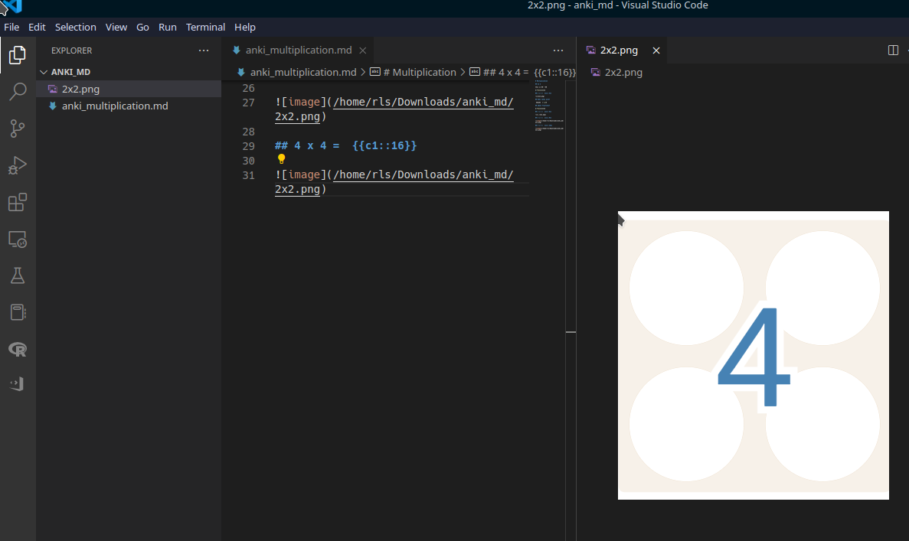
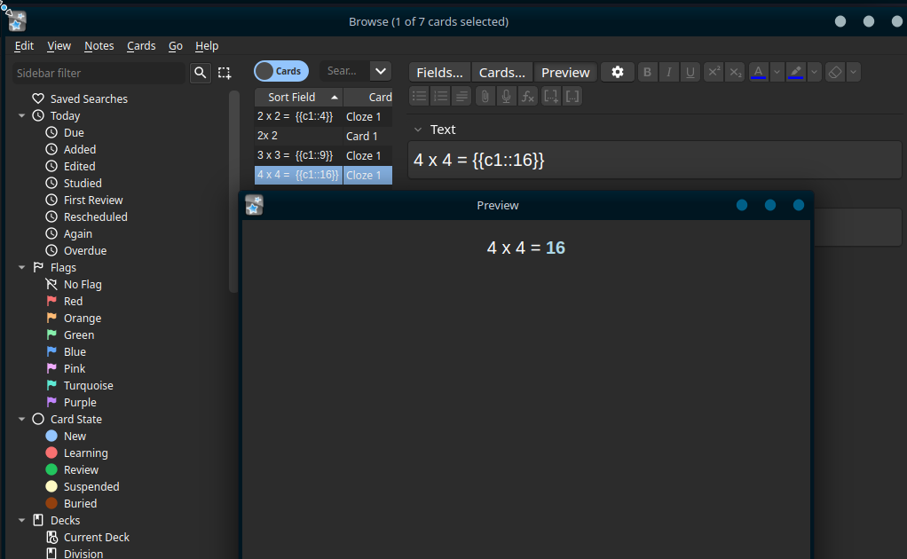

vscode_anki_repo
================

<!-- WARNING: THIS FILE WAS AUTOGENERATED! DO NOT EDIT! -->

## steps

- Open Anki app \> Tools Menu \> Addons \> Press Get addons button \>
  install AnkiConnect

- Create `.md` file in vscode (file in repot `anki_multiplication.md`)

- Enter line of code to insert image

``` markdown

```

- `Anki: Send to Deck` command in VSCode’s commmand palette
  `Ctrl+Shift+p`

- Open Anki app \> Deck \> notes

Result image not displayed




